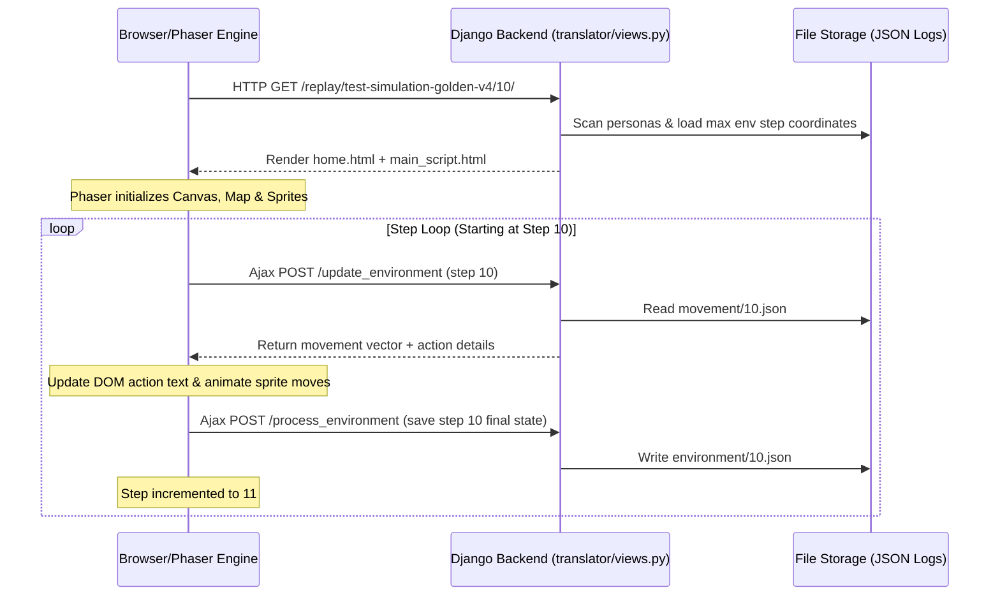

# Walkthrough: Anatomy of a Replay Step

This walkthrough explains the detailed end-to-end execution flow of the Generative Agents simulation environment when replaying a pre-computed simulation. 

Specifically, we trace what happens when you visit:
`http://localhost:8000/replay/test-simulation-golden-v4/10/`

---

## ⏱️ Step Definition & Lifecycle (Run, Save, & Demo)

* **Game Step Definition**: Each simulation step represents **10 seconds** of in-game time (e.g., Step `10` is 100 seconds from simulation start).
* **Running a Simulation**: Start the backend server via `python reverie.py`. Fork a base scenario (e.g. `base_the_ville_isabella_maria_klaus`), specify a new simulation name (like `test-simulation-golden-v4`), and trigger steps using `run <step-count>` (e.g., `run 100`).
* **Saving States**: Typing `fin` in the backend CLI saves all computed states into `environment/frontend_server/storage/<simulation-name>/`.
* **Demos & Playback**: For visual demo optimization (loading custom character sprites), run the `compress` function inside `compress_sim_storage.py`. The simulation files are saved to `compressed_storage`, which can then be played back via `http://localhost:8000/demo/<simulation-name>/<step>/<speed>`.

---

## 🗺️ High-Level Architecture Overview

The application uses a **hybrid client-server architecture**:
1. **Django Backend Server** acts as the data provider, serving static pages, loading saved simulation logs, and recording environment state history.
2. **Phaser 3 Frontend Client** runs inside the browser. It renders the game world, animates the characters, and orchestrates the step-by-step game loop using async AJAX polling back to Django.



---

## 🧵 Phase-by-Phase Walkthrough

### Phase 1: Django Routing & View Initialization

When the URL is loaded, Django intercepts it via the routing system and extracts the parameters.

1. **Routing**: [urls.py](file:///Users/sangeetha/Supportvector2026/llm/projects/llmclassprojects/generative_agents/environment/frontend_server/frontend_server/urls.py#L28) matches the regular expression pattern:
   ```python
   url(r'^replay/(?P<sim_code>[\w-]+)/(?P<step>[\w-]+)/$', translator_views.replay, name='replay')
   ```
   For our URL, this captures:
   - `sim_code` = `"test-simulation-golden-v4"`
   - `step` = `10`

2. **View Logic**: The request is routed to the [replay](file:///Users/sangeetha/Supportvector2026/llm/projects/llmclassprojects/generative_agents/environment/frontend_server/translator/views.py#L152-L183) function inside `views.py`. Here is what happens:
   - **Persona Detection**: It scans the directory `storage/test-simulation-golden-v4/personas` using `find_filenames` to retrieve the list of characters (e.g., Isabella Rodriguez, Maria Lopez, Klaus Mueller).
   - **Initial Positions**: It scans `storage/test-simulation-golden-v4/environment/*.json` to find the environment snapshot files, calculates the highest index step (`max(file_count)`), and opens that environment file (e.g. `1199.json`) to determine the starting coordinates of each persona on the grid.
   - **Context Construction**: It packs these values into the rendering context:
     ```python
     context = {
         "sim_code": "test-simulation-golden-v4",
         "step": 10,
         "persona_names": [["Isabella Rodriguez", "Isabella_Rodriguez"], ...],
         "persona_init_pos": [["Isabella Rodriguez", 72, 14], ...],
         "mode": "replay"
     }
     ```
   - **Rendering HTML**: It returns the template [home/home.html](file:///Users/sangeetha/Supportvector2026/llm/projects/llmclassprojects/generative_agents/environment/frontend_server/templates/home/home.html) which serves as the visual shell.

---

### Phase 2: Page Render & Phaser Canvas Mount

Once the browser receives the HTML response:

1. **Static DOM Layout**: [home.html](file:///Users/sangeetha/Supportvector2026/llm/projects/llmclassprojects/generative_agents/environment/frontend_server/templates/home/home.html) sets up the layout:
   - `<div id="game-container">`: The canvas anchor point.
   - Info panels for each character showing **Current Action**, **Location**, and **Current Conversation**.
   - Action links to view their underlying Cognitive State details via [replay_persona_state](file:///Users/sangeetha/Supportvector2026/llm/projects/llmclassprojects/generative_agents/environment/frontend_server/translator/views.py#L186-L232).

2. **Phaser Engine Bootstrapping**: The script [main_script.html](file:///Users/sangeetha/Supportvector2026/llm/projects/llmclassprojects/generative_agents/environment/frontend_server/templates/home/main_script.html) reads the initial setup data from hidden template container divs:
   - `step` = `10`
   - `sim_code` = `"test-simulation-golden-v4"`
   - `persona_init_pos` = Isabella: `(72, 14)`, Klaus: `(126, 46)`, Maria: `(123, 57)`

3. **Game Preloading (`preload`)**:
   - Phaser fetches visual assets for the tilemap `the_ville` (blocks, walls, interiors, decoration tilesets) from the static folders.
   - It downloads `the_ville_jan7.json` (the tile matrix metadata defining collisions, wall boundaries, and coordinates).
   - It preloads the character sprite atlas containing walking animation sheets.

4. **Game Scene Creation (`create`)**:
   - Renders the multi-layered visual grid (Ground layers, Exterior Ground, Walls, Furniture, Foreground).
   - Spawns the persona sprite instances at their start tile coordinates (multiplied by `tile_width` = 32 pixels).
   - Instantiates character text indicators showing their initials and action emojis (e.g., `💤`).
   - Standardizes camera logic to follow a virtual "player" node controllable by arrow keys.

---

### Phase 3: The 3-Phase Simulation / Replay Loop (`update`)

The core engine relies on Phaser's `update(time, delta)` loop running every frame. The loop drives agent behavior through three sequence phases:

```
[Phase: update] ──(Ajax get movement metadata)──> [Phase: execute] ──(Animate & Snap moves)──> [Phase: process] ──(Ajax save locations)──> [Next Step]
```

#### Phase A: `update` (Polling for Directives)
In this phase, the client checks if the movement plan for the current step is loaded.
- Since it starts at step `10`, it triggers an asynchronous POST request to the Django endpoint [update_environment](file:///Users/sangeetha/Supportvector2026/llm/projects/llmclassprojects/generative_agents/environment/frontend_server/translator/views.py#L268-L296) payload:
  ```json
  {"step": 10, "sim_code": "test-simulation-golden-v4"}
  ```
- Django inspects the folder `storage/test-simulation-golden-v4/movement/` for `10.json`.
- The contents of `10.json` are read and returned to Phaser.

> **Sample File**: `storage/test-simulation-golden-v4/movement/10.json`
> ```json
> {
>   "persona": {
>     "Isabella Rodriguez": {
>       "movement": [72, 14],
>       "pronunciatio": "💤",
>       "description": "asleep @ the Ville:Isabella Rodriguez's apartment:main room",
>       "chat": null
>     },
>     "Maria Lopez": {
>       "movement": [123, 57],
>       "pronunciatio": "💤",
>       "description": "asleep @ the Ville:Dorm for Oak Hill College:Maria Lopez's room",
>       "chat": null
>     },
>     "Klaus Mueller": {
>       "movement": [126, 46],
>       "pronunciatio": "💤",
>       "description": "asleep @ the Ville:Dorm for Oak Hill College:Klaus Mueller's room",
>       "chat": null
>     }
>   },
>   "meta": {
>     "curr_time": "February 13, 2023, 00:01:40"
>   }
> }
> ```

- Once the response is validated, Phaser updates its local `execute_movement` state and switches its active phase to `"execute"`.

#### Phase B: `execute` (Visual Animation & HTML DOM Updates)
Phaser updates the visual page details and animates the grid transitions:
- **DOM Panel Updates**: Parses the `description` split by the `@` symbol:
  - Updates the text for **Current Action** (e.g. `"asleep"`)
  - Updates the text for **Location** (e.g. `"the Ville:Isabella Rodriguez's apartment:main room"`)
  - Updates **Current Conversation** (or prints *None at the moment*)
- **Movement Target Setup**: Maps grid coords to actual Phaser pixel bounds:
  - `movement_target["Isabella Rodriguez"]` = `[72 * 32, 14 * 32]` = `[2304, 448]`
- **Step Motion Rendering**:
  - Compares the character's current position to `movement_target`.
  - Increments or decrements coordinates by `movement_speed` (32 pixels).
  - Triggers walk animations in the correct direction (e.g. `misa-left-walk`, `misa-front-walk`).
  - Once the movements are completed and the remaining ticks run down to `0`, Phaser snaps the character coordinates to exact values and switches the phase to `"process"`.

#### Phase C: `process` (State Snap-shotting)
Now that step `10` is completed, the frontend must register the update:
- Collects the final coordinates of all active agents on the map:
  ```json
  {
    "step": 10,
    "sim_code": "test-simulation-golden-v4",
    "environment": {
      "Isabella Rodriguez": {"maze": "the_ville", "x": 72, "y": 14},
      "Klaus Mueller": {"maze": "the_ville", "x": 126, "y": 46},
      "Maria Lopez": {"maze": "the_ville", "x": 123, "y": 57}
    }
  }
  ```
- POSTs this details to Django view [process_environment](file:///Users/sangeetha/Supportvector2026/llm/projects/llmclassprojects/generative_agents/environment/frontend_server/translator/views.py#L241-L265).
- Django writes this update on disk to: `storage/test-simulation-golden-v4/environment/10.json`.
- Phaser increments the counter step to `11`, resets the cycle counters, and moves the phase back to `"update"` to begin the next iteration.

---

## 💡 Talking Points for Teaching New Developers

1. **Decoupled Simulation vs. Visualization**: The backend simulation (calculating thoughts, dialogues, and coordinates) runs asynchronously from the browser. The frontend simply plays back these steps by querying pre-computed JSON maps (`storage/<sim_code>/movement/<step>.json`).
2. **Grid coordinates scale to Pixels**: Phaser works with pixel-based coordinates, while the simulation operates on a `32x32` grid. All coordinates must be scaled using `tile_width = 32` pixels.
3. **Phaser State Machine**: Understanding the visual flow requires looking closely at [main_script.html](file:///Users/sangeetha/Supportvector2026/llm/projects/llmclassprojects/generative_agents/environment/frontend_server/templates/home/main_script.html). Point out the three phases (`update`, `execute`, `process`) in the main loop to explain how animations are synchronized.
4. **Key Logs on Disk**:
   - `environment/*.json` files track the **positions** of the agents at each step.
   - `movement/*.json` files contain the **activity details, dialogue transcripts, and emoji states** at each step.
